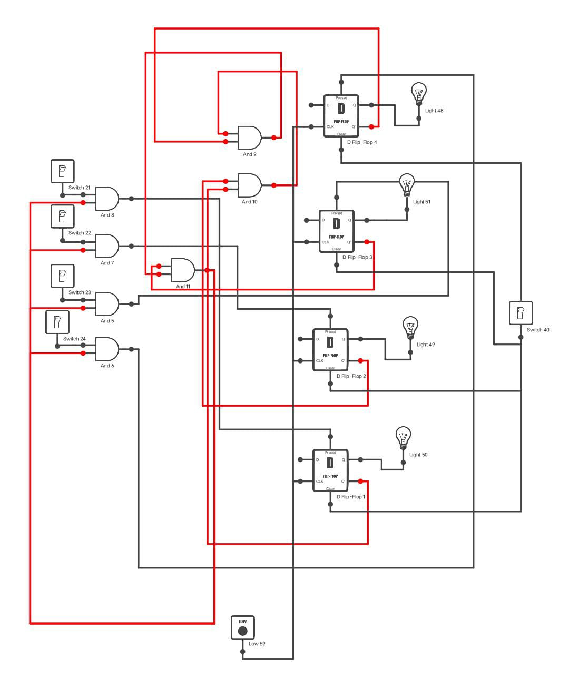
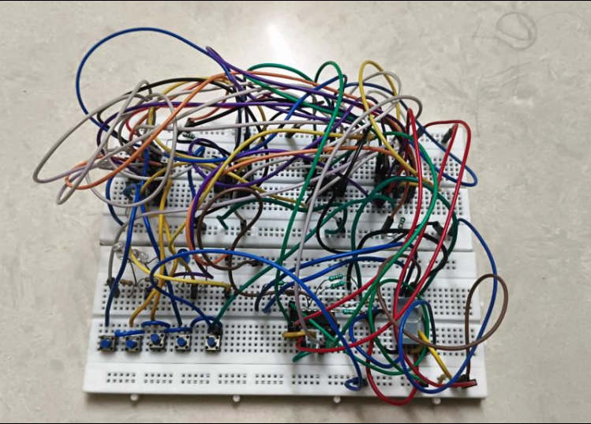

# 🔔 Quiz Buzzer System

A **digital logic–based quiz buzzer system** that detects and locks the **first button press** among four players and displays the corresponding player number on a 7-segment display.

---

## 📌 Overview
This project uses basic digital components like flip-flops and logic gates to ensure only the **first buzzer press is registered**, while all others are ignored until reset.

---

## ⚙️ How It Works

1. Each player's buzzer is connected to a **D flip-flop**.  
2. When a player presses the buzzer:
   - The flip-flop **latches the input**.
   - Logic ensures **only the first press is accepted**.
3. The output is encoded in binary:
   - Player 1 → `0001`
   - Player 2 → `0010`
   - Player 3 → `0100`
   - Player 4 → `1000`
4. The binary output is sent to a **7447 BCD-to-7-segment decoder**.
5. The decoder drives the **7-segment display**.
6. A reset button clears the system for the next round.

---

## 🔢 Output Display

| Player | Binary | Display |
|--------|--------|--------|
| Player 1 | 0001 | 1 |
| Player 2 | 0010 | 2 |
| Player 3 | 0100 | 4 |
| Player 4 | 1000 | 8 |

---

## 🛠️ Components Used

- D Flip-Flops (74LS74)
- AND Gates (74LS08)
- BCD to 7-Segment Decoder (7447)
- Common Anode 7-Segment Display
- Push Buttons (4)
- Reset Button
- 5V Power Supply
- Breadboard / PCB
- Connecting Wires

---

## 🧠 Concepts Applied

- Digital Electronics  
- Sequential Logic  
- Combinational Logic  
- Flip-Flop Design  
- Binary Encoding  

---

## 📁 Project Files

| File Name | Description |
|----------|------------|
| `Circuit_diagram.jpg` | Circuit schematic |
| `Project.png` | Working model snapshot |
| `README.md` | Project documentation |

---

## 📷 Project Preview

  

---

## 🚀 Future Improvements

- 🔊 Add buzzer sound for first responder  
- 👥 Expand system for more players  
- 🤖 Integrate microcontroller for scoring  
- 💡 Add LED indicators for lock status  
- 📡 Implement wireless buzzers  

---

## 📌 How to Use

1. Power the circuit (5V DC).
2. Press any buzzer.
3. The **first press gets locked** and displayed.
4. Press **Reset** to start a new round.

---

## 👨‍💻 Author

- Sriinidhi M  
- Electronics and Communication | MIT Chennai  

---

## ⭐ Contribution

Feel free to fork this repo and improve the project!

---

## 📜 License

This project is open-source and available under the MIT License.
